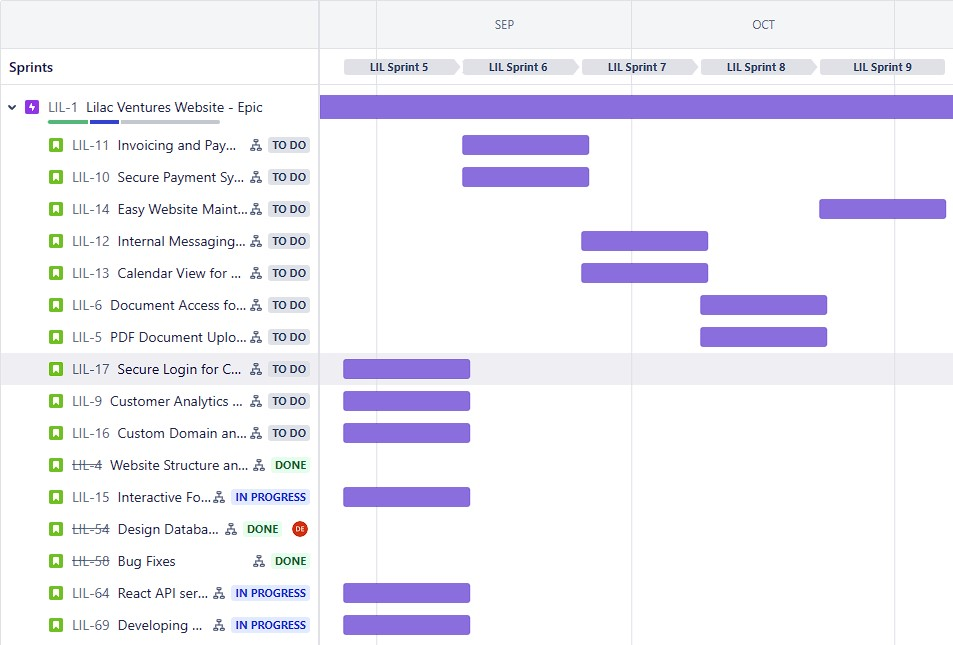

<h1 align="center"> Lilac Ventures Website - Algo Avengers</h1> <br>
<p align="center">
  <a href="./imgs/ReadMeTop.jpg">
    
  </a>
</p>

## Table of Contents
- [Project Synopsis](#project-synopsis)
- [Software Images](#software-images)
- [Dependencies](#dependencies)
- [Deployment](#deployment)
- [Testing Instructions](#testing-instructions)
- [Developer Instructions](#developer-instructions)
- [Timeline](#timeline)

## Project Synopsis

  Lilac Ventures is a website that is going to help customers communicate with the business owner to facilitate mentorship and transactions for financial coaching. The website will offer analytics to the business owner to develop customized solutions for each customer. The website will allow the business owner to manage customer data and schedule appointments to ease communication. It will also allow both the owner and customer to track progress on what documents are required to complete the process. Clients will also have the ability to pay within the website for the services that they have obtained. Both a client and customer portal will be implemented, each displaying its own analytics.  

## Software Images

### Logo


### ERD


### Product Images
 


## Dependencies
Dependencies are listed in package.json. They can be installed using any dependency manager. The team recommends and uses npm. The command to install all
dependencies using npm is
```
npm install
```


## Deployment

Required/Recommended resources:

[VsCode][https://code.visualstudio.com/] 

[Node.js](https://nodejs.org/en/download)

Setup instructions/deployment steps:
1. Install VS code and Node.js - follow the link above for downlaod and install instructions for both Node and VsCode
2. Once the project is pulled from Github, run npm init at the project’s root folder.
3. Run ```npm start``` at the root to start the React server
4. Run ```node ./api/server.ts``` to start the ExpressJS server
5. The website can is hosted on localhost//3000/ by default

## Testing Instructions
### Test Suite: 
* Most testing was done through UI/UX testing. Every feature was identified and testing involved developing start, intermediate, and final steps for interacting with the UI of the deployed site. This includes both invalid and invalid input to check for error handling.
* The project is configured for Jest testing if that is desired in the future. Jest tests are done by running ```npm test```. The test are in the `./test` directory. New tests should be added here. Each new test file should follow the format of `<filename>.test.ts`.
*  
### Test Coverage: how we measure test coverage and what percentage of code is currently covered by tests
* ~90% of the front-end was tested. Every page on the site was listed, and features were mapped out for each page- this includes navigation throughout the site. For each feature, tests were developed to emulate user use of the site. Funactionality for valid inputs were tested and several edge cases with invalid input.
* Example: Testing the Messaging service
*   Recieving messages
*   Checking Inbox, trash, and sent inboxes
*   Sending Messages
*   Replying to messages
*   Deleting messages

## Developer Instructions

### Contributing guidelines 
* Individual developers must create their own branch on which to work on. Once the developer has completed their tasks on their branch, they must:
  * Commit their changes to their branch.
    * Commits follow the naming scheme: ``` LIL-# Task Description ```
    * Ex. ``` LIL-02 Updated Login Page ```
  * Publish the branch to the main Github repository
* Once the branch has been published to the main repository, developers must create a pull request to merge their code with the team's existing code:
  * Navigate to the ```Pull requests``` tab on Github
  * Select ```New pull request```
  * Select the branches you are merging
    * <b>IMPORTANT</b>: The developer’s branch must be merged into the <u>development branch</u> and NOT the main branch. 
  * Complete the pull request process and request a review
* Once a pull request has been created. Another developer will review the request and confirm the merge into the development branch. At the end of each sprint, the development branch will be merged into the main branch.  

### Troubleshooting
Run ```npm install``` at the root to start the project to install any missing dependencies

## Timeline


### Sprint 5 (2023/08/28 - 2023/9/11)
1. Secure Login for Customer: 
    * Implement secure customer login with a login page that connects to the customer portal, the option to change a password, and login protected user information and functions. 
2. Interactive Forms: 
    * Complete the interactive webform functionality with form validation. 
3. Custom Domain and Email: 
    * Register a domain and hosting service. Setup domain email address for client.
4. Customer Analytics: 
    * Implement software to collect and store analytics data on customers. Create dashboard where client can view analytics data about customers (location, age, gender, etc).
5. Register Client name and custom email with hosting service.
6. Continue implementing React API services.
7. Continue implementing UI Components.

### Sprint 6  (2023/09/11 - 2023/09/25)
1. Payment System implementation: 
    * In this sprint we plan to work on and complete an invoicing and payment management system so that our client will have a way to bill their customers.We also plan to have all the necessary security features implemented to make the payment secure. 

### Sprint 7 (2023/09/25 - 2023/10/09)
1. Internal Messaging System: 
    * Implement an inbox system through which client and customers can communicate. Inbox should be integrated within the website and easily accessible, and allow the client and customers to communicate in real time.
2. Calendar View: 
    * Implement a Calendar view accessible by both client and customers allowing them to track appointments. Calendar should allow the client to create, cancel, or reschedule appointments for customers.

### Sprint 8 (2023/10/09 - 2023/10/23)
1. Document Management: 
    * Implement Database of customer documents with access control and basic file manipulation (rename, delete, etc.). 
2. Document Upload: 
    * Implement secure file upload feature. Feature should only be accessible to authenticated users. Documents should be stored in the database once uploaded.

### Sprint 9 (2023/10/23 - 2023/11/06)
1. Content Management System (CMS): 
    * Implement a system to allow the client to easily update/modify the website. CMS should allow the client to add, edit, or delete pages and their respective content without needing any coding knowledge. The CMS should be scalable and flexible so the client can add new features/functionality to the website as it grows.

