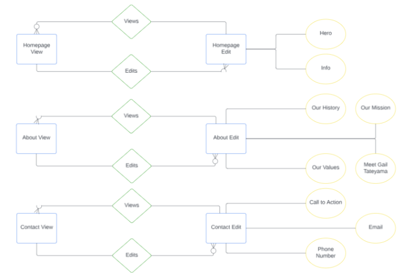
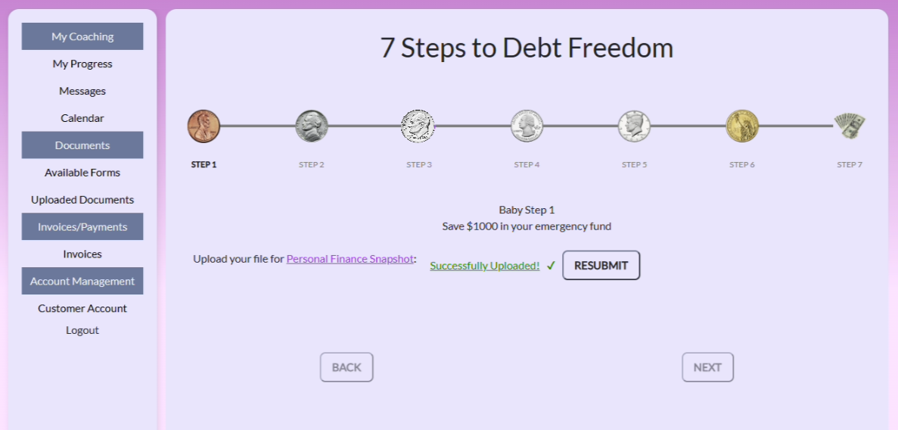
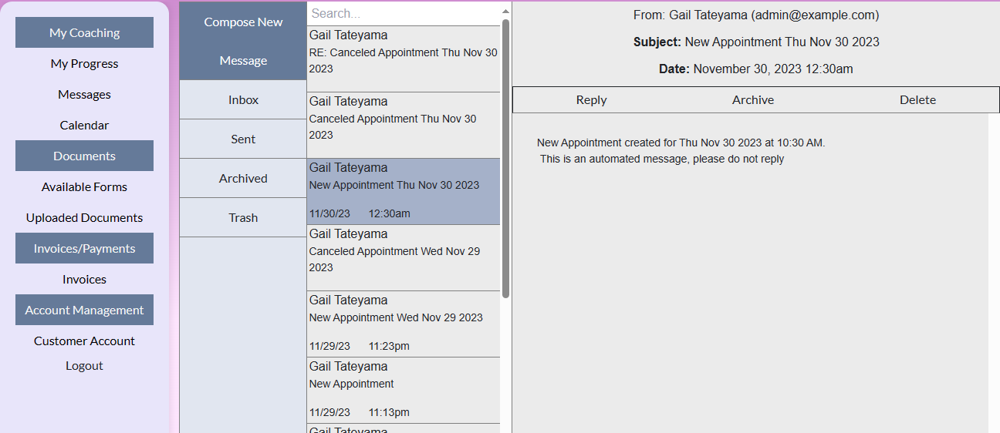
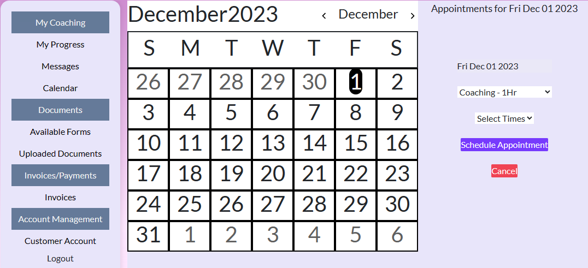
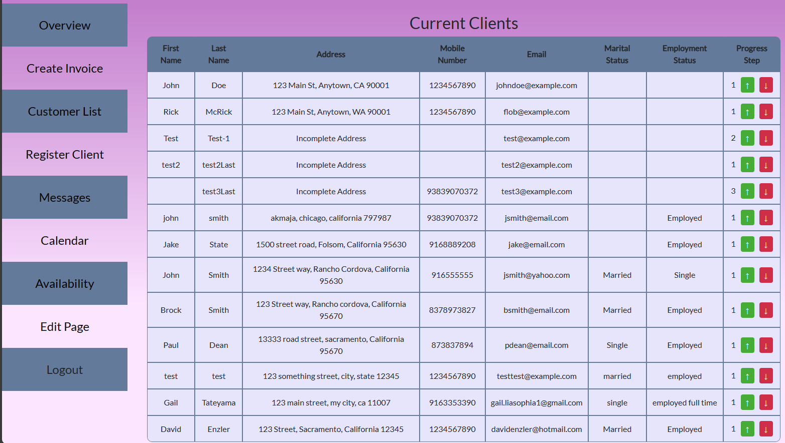

<h1 align="center"> Lilac Ventures Website - Algo Avengers</h1> <br>
<p align="center">
  <a href="./imgs/ReadMeTop.jpg">
    
  </a>
</p>

## Contributors
- David Enzler: davidlenzler@csus.edu
- Prasad Prabhu: pprabhu@csus.edu
- Nathaniel Cruz: ncruz@csus.edu
- Justin Roome: justinroome@csus.edu
- Robert Mancuso: rmancuso@csus.edu
- Ryan McCormick: ryanmccormick@csus.edu
- Francisco Avalos: favalos2@csus.edu
- Sir Christian Orefer Casals: scasals@csus.edu

## Table of Contents
- [Project Synopsis](#project-synopsis)
- [Software Images](#software-images)
- [Dependencies](#dependencies)
- [Deployment](#deployment)
- [Testing Instructions](#testing-instructions)
- [Developer Instructions](#developer-instructions)
- [Timeline](#timeline)
- [Relevant Documents](#relevant-documents)

## Project Synopsis

  Visit: https://www.lilacfinancials.com/
  
  Lilac Ventures is a website that is going to help customers communicate with the business owner to facilitate mentorship and transactions for financial coaching. The website will offer analytics to the business owner to develop customized solutions for each customer. The website will allow the business owner to manage customer data and schedule appointments to ease communication. It will also allow both the owner and customer to track progress on what documents are required to complete the process. Clients will also have the ability to pay within the website for the services that they have obtained. Both a client and customer portal will be implemented, each displaying its own analytics.  

  Our client wishes to fully integrate the website into her business, not only as a management tool but also as a marketing tool. Our client tasked us with designing a visually appealing and user-friendly website so that she can grow her business and deliver financial success to her customers. Our client wants all business interactions to revolve around the website, so our website must cater to all her business needs.​

  Features: A system that allows the client to update the website as required and provide basic maintenance features.​ Inbox for communication between the business owner and their customers. ​A calendar page and a way to schedule appointments​. Invoicing and payment systems integration​. Data management system. Account system to keep track of individual customer progress.

  
## Software Images

### Logo


### ERD



### Product Images
*  
  * Home Page
* 
  * Customer Portal - Progress Bar
* 
  * Customer Portal - Messaging System
* 
  * Customer Portal - Calandar/Appointment System
* 
  * Admin Portal


## Dependencies
Dependencies are listed in package.json. They can be installed using any dependency manager. The team recommends and uses npm. The command to install all
dependencies using npm is
```
npm install
```


## Deployment

Required/Recommended resources:
-VS code
[-Node.js](https://nodejs.org/en/download)
Setup instructions/deployment steps:
1. Install VS code and Node.js
2. Once the project is pulled from Github, run npm init at the project’s root folder.
3. Run ```npm start``` at the root to start the React server
4. Run ```node ./api/server.ts``` to start the ExpressJS server
5. The website can is hosted on localhost//3000/ by default

## Testing Instructions
### Test Suite: testing frameworks and tools used
* The test's completed were primarily UI/UX tests. Those tests can be found in the [testing document](imgs/System%20Test%20Report%20AlgoAvengers.pdf). 
* A few tests were performed using Jest and can be found [here](https://github.com/davidenzler/lilac_ventures_website/tree/main/tests).
### How to Test
* To perform the Jest tests, you first must pull the code to an IDE. Then you can open a terminal and type: ``` npm test```. The tests will then run and display a message as to whether the tests passed or not. Further Jest testing can be configured by adding tests to the `./test` folder and naming any tests
`<test_file_name>.test.ts`

* The UI/UX tests can be duplicated by following the steps described in this [testing document](imgs/System%20Test%20Report%20AlgoAvengers.pdf).
### Known Issues
* None 

## Developer Instructions

### Download, Run, and Deploy
* Instructions on how to download the code and setup to run/deploy can be found in the [Maintenance Manual](imgs/Maintenance%20Manual.pdf).

### Contributing guidelines 
* Individual developers must create their own branch on which to work on. Once the developer has completed their tasks on their branch, they must:
  * Commit their changes to their branch.
    * Commits follow the naming scheme: ``` LIL-# Task Description ```
    * Ex. ``` LIL-02 Updated Login Page ```
  * Publish the branch to the main Github repository
* Once the branch has been published to the main repository, developers must create a pull request to merge their code with the team's existing code:
  * Navigate to the ```Pull requests``` tab on Github
  * Select ```New pull request```
  * Select the branches you are merging
    * <b>IMPORTANT</b>: The developer’s branch must be merged into the <u>development branch</u> and NOT the main branch. 
  * Complete the pull request process and request a review
* Once a pull request has been created. Another developer will review the request and confirm the merge into the development branch. At the end of each sprint, the development branch will be merged into the main branch.  

### Troubleshooting
Run ```npm install``` at the root to start the project to install any missing dependencies

## Timeline


### Sprint 5 (2023/08/28 - 2023/9/11)
1. Secure Login for Customer: 
    * Implement secure customer login with a login page that connects to the customer portal, the option to change a password, and login protected user information and functions. 
2. Interactive Forms: 
    * Complete the interactive webform functionality with form validation. 
3. Custom Domain and Email: 
    * Register a domain and hosting service. Setup domain email address for client.
4. Customer Analytics: 
    * Implement software to collect and store analytics data on customers. Create dashboard where client can view analytics data about customers (location, age, gender, etc).
5. Register Client name and custom email with hosting service.
6. Continue implementing React API services.
7. Continue implementing UI Components.

### Sprint 6  (2023/09/11 - 2023/09/25)
1. Payment System implementation: 
    * In this sprint we plan to work on and complete an invoicing and payment management system so that our client will have a way to bill their customers.We also plan to have all the necessary security features implemented to make the payment secure. 

### Sprint 7 (2023/09/25 - 2023/10/09)
1. Internal Messaging System: 
    * Implement an inbox system through which client and customers can communicate. Inbox should be integrated within the website and easily accessible, and allow the client and customers to communicate in real time.
2. Calendar View: 
    * Implement a Calendar view accessible by both client and customers allowing them to track appointments. Calendar should allow the client to create, cancel, or reschedule appointments for customers.

### Sprint 8 (2023/10/09 - 2023/10/23)
1. Document Management: 
    * Implement Database of customer documents with access control and basic file manipulation (rename, delete, etc.). 
2. Document Upload: 
    * Implement secure file upload feature. Feature should only be accessible to authenticated users. Documents should be stored in the database once uploaded.

### Sprint 9 (2023/10/23 - 2023/11/06)
1. Content Management System (CMS): 
    * Implement a system to allow the client to easily update/modify the website. CMS should allow the client to add, edit, or delete pages and their respective content without needing any coding knowledge. The CMS should be scalable and flexible so the client can add new features/functionality to the website as it grows.

### Relevant Documents
* [Maintenance Manual](imgs/Maintenance%20Manual.pdf)
* [Testing Report](imgs/System%20Test%20Report%20AlgoAvengers.pdf)
* [User Manual](imgs/User_Manual_AlgoAvengers-1.pdf)
